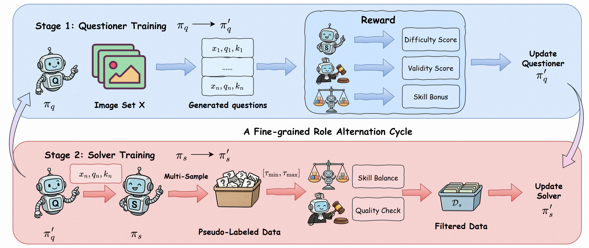

# RISE: Reliable Improvement in Self-Evolving Vision-Language Models

This repository contains the official code for **RISE**, a self-evolving training framework for vision-language models. RISE improves a VLM from unlabeled images by letting the model play two complementary roles:

- a **questioner**, which proposes challenging image-grounded questions;
- a **solver**, which learns from pseudo-labeled answers produced in the loop.

The core goal of RISE is to make VLM self-evolution more reliable. In practice, naive self-evolving pipelines can generate invalid questions, produce noisy pseudo labels, or collapse toward a narrow set of easy question types. RISE addresses these issues with **fine-grained role alternation**, a **quality supervisor**, and **skill-aware dynamic balancing**.

## Method Overview



At each fine-grained alternation cycle, RISE performs two stages:

1. **Questioner training**  
   The questioner is optimized with GRPO to generate structured visual reasoning questions. Its reward combines solver difficulty, question validity, and a skill-balance bonus.

2. **Solver training**  
   The updated questioner first generates questions from unlabeled images. The solver then samples multiple answers for each question, constructs majority-voted pseudo labels, filters them with confidence and supervisor checks, and trains on the resulting skill-balanced pseudo-labeled VQA data. Solver reward is computed by comparing extracted boxed answers against the pseudo labels.

The implementation in `scripts_Qwen3-VL-8B/` runs this loop end to end, including questioner training, question generation, solver-side pseudo-label construction, solver training, and checkpoint merging.

## Environment

Run all commands from the repository root:

```bash
cd /path/to/RISE
```

Create the environment:

```bash
conda env create -f environment.yml
conda activate RISE
export PYTHONPATH="$PWD:${PYTHONPATH:-}"
```

Depending on your cluster image, you may also need a recent vLLM build with Qwen2.5-VL/Qwen3-VL support.

## Data Preparation

Log in to Hugging Face if required:

```bash
huggingface-cli login
```

Download the datasets:

```bash
export HF_HOME=/path/to/hf_cache
export RISE_DATASET_ROOT=../datasets/parquet
python dataset_down_load.py
```

If your dataset layout differs, update the paths in:

```text
scripts_Qwen3-VL-8B/questioner_train.sh
scripts_Qwen3-VL-8B/solver_train.sh
Evaluation/dataset_registry.yaml
```

## Model Preparation

Place the base model under your model directory. The default scripts expect:

```text
../pretrained_LM/Qwen3-VL-8B-Instruct
```

You can also override the roots from the shell:

```bash
export DATA_DIR=../datasets
export MODEL_DIR=../pretrained_LM
export STORAGE_PATH=../storage_RISE_Qwen3-VL-8B
export MODEL_SAVE_ROOT=$STORAGE_PATH/models
```

## Training

Run the full RISE training loop:

```bash
bash scripts_Qwen3-VL-8B/main.sh
```

The training scripts follow the two-stage RISE cycle described in the paper:

- `scripts_Qwen3-VL-8B/main.sh` is the top-level controller. It alternates between questioner and solver updates in fine-grained micro-iterations, tracks the latest checkpoints, and passes the updated roles into the next cycle.
- `scripts_Qwen3-VL-8B/questioner_train.sh` implements the **questioner training** stage. The current solver is launched as the reward/supervisor model, and the questioner is optimized to produce valid, image-grounded, skill-aware questions near the solver's capability boundary.
- `scripts_Qwen3-VL-8B/solver_train.sh` implements the **solver training** stage. It first uses the updated questioner to generate questions offline, samples multiple solver answers to construct majority-voted pseudo labels, filters the data with confidence and supervisor checks, applies skill-balanced sampling, and then trains the solver on the filtered pseudo-labeled data.

The final solver checkpoints are saved under:

```text
$MODEL_SAVE_ROOT/Qwen3-VL-8B-Instruct_s_b*/global_step_*/actor/huggingface
```

## Evaluation

First configure benchmark paths in:

```text
Evaluation/dataset_registry.yaml
```

For LLM-judge evaluation, set your OpenAI-compatible judge endpoint:

```bash
export JUDGE_API_KEY=your_api_key
export JUDGE_API_URL=https://your-openai-compatible-endpoint/v1/chat/completions
export JUDGE_MODEL=your_judge_model
```

Then run evaluation. By default, the script is intended to run both rule-based and LLM-judge evaluation:

```bash
bash validation_examples/run_generate_and_eval.sh \
  --model_path /path/to/trained_or_base_model \
  --model_name your_model_name \
  --experiment_name your_eval_name \
  --registry Evaluation/dataset_registry.yaml \
  --output_root ../storage_RISE_Qwen3-VL-8B/evaluation_metrics \
  --mode both \
  --n_gpus_per_node 4 \
  --tensor_parallel_size 2
```

To evaluate a single dataset:

```bash
bash validation_examples/run_generate_and_eval.sh \
  --model_path /path/to/trained_or_base_model \
  --model_name your_model_name \
  --experiment_name your_eval_name \
  --dataset MMMU \
  --mode both
```

## Notes

- You may need to adapt GPU placement, storage roots, and dataset paths to your cluster environment.
- Generated pseudo-labeled data are saved under `$STORAGE_PATH/local_parquet`.
- Intermediate generated questions and solver responses are saved under `$STORAGE_PATH/generated_question`.
- Newly trained actor checkpoints are merged into Hugging Face format before being used in the next stage.


## Acknowledgements

We thank the open-source community for making this research easier to reproduce and extend. In particular, this project is inspired by and benefits from the open-source contributions of [R-Zero](https://github.com/Chengsong-Huang/R-Zero) and [VisPlay](https://github.com/bruno686/VisPlay), as well as the broader ecosystem around vLLM, Hugging Face Transformers, and GRPO-style VLM training. We also gratefully acknowledge [veRL](https://github.com/volcengine/verl) for providing a flexible and efficient reinforcement learning training framework that serves as the foundation of our training pipeline.
